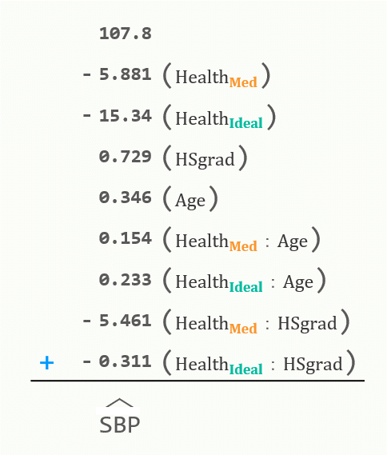
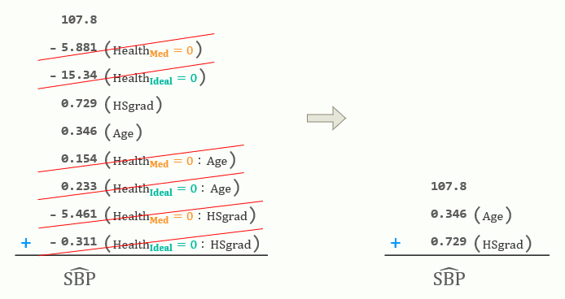
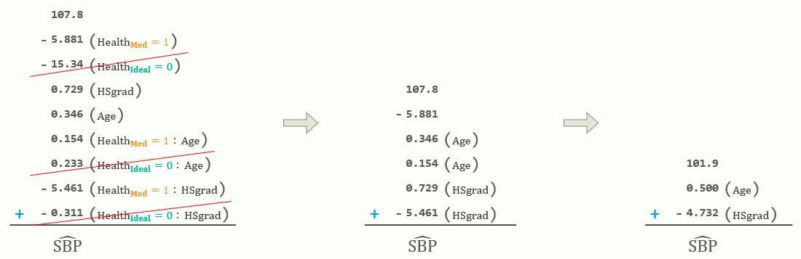
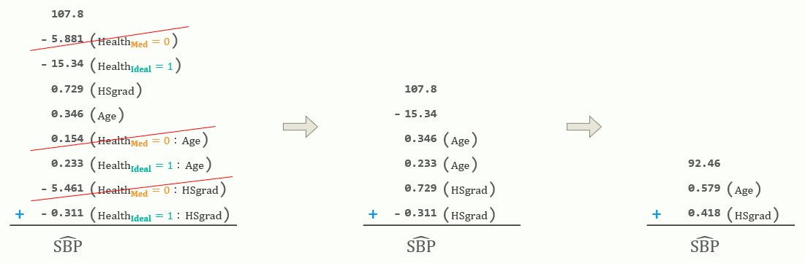

<head>

<link rel="stylesheet" href="https://fonts.googleapis.com/css?family=Montserrat">

<style>

body {
color: #5A5A5A;
background-color: #F4F4ED;
}

pre {
color: #5A5A5A;
background-color: #FFFFFF;
border: 1px solid #CDC8B1;
} 

pre.sourceCode {
color: #3B3A3A;
background-color: #FFFFFF;
border: 1px solid #CDC8B1;
}

pre>code, div.sourceCode {
font-size: 12px !important;
} 

body .container-fluid .well {
background-color: #FCFEF9;
}

.header-panel h4, h1.title {
color: #EEE8CD;
}

.header-panel {
background-color: #8B8878;
}

.pages h1 {
color: #7B796F !important;
font-size: 42px !important;
}

.pages h4 {
color: #7B796F !important;
font-size: 20px;
}

.nav-tabs {
background-color: #F4F4ED;
font-size: 26px;
}

.pages .nav-tabs {
background-color: #FCFEF9;
font-size: 26px;
}

.pages .nav-tabs>li.active>a {
background-color: #E6E6D8 !important;
color: #7B796F !important;
font-size: 26px;
}

.pages .nav-tabs>li>a:hover {
font-weight: 900 !important;
font-size: 26px;
}

.nav-tabs>li>a {
color: #7B796F !important;
font-size: 26px;
}

.nav-tabs>li>a:hover {
color: #7B796F !important;
font-weight: 900 !important;
background-color: #F4F4ED;
font-size: 26px;
}

.nav-tabs>li>a:focus {
color: #7B796F !important;
}

code {
color: #5A5A5A;
background-color: #E3FFF8;
font-weight: 350;
font-size: 14px !important;
}

.menu ul li.active, .menu ul li.active>a {
background-color: #E6E6D8 !important;
color: #7B796F !important;
font-size: 26px;
}

#toc .nav>li.active>a:focus {
background-color: #E6E6D8 !important;
color: #7B796F !important;
font-size: 26px;
}

#toc .nav>li.active>a:hover {
background-color: #F4F4ED;
font-weight: 900 !important;
font-size: 26px;
}

#toc .nav>li>a:hover {
background-color: #F4F4ED;
font-weight: 900 !important;
font-size: 26px;
}

#toc .nav>li>a {
color: #7B796F !important;
font-size: 26px;
}

.footnotes {
color: #F4F4ED;
font-weight: 700;
font-size: 16px;
}

.footnotes p {
color: #FA962D;
font-weight: 300;
font-size: 16px;
}

.footnotes a, .footnotes a:focus, .footnotes a:hover {
color: #F4F4ED;
font-weight: 700;
font-size: 16px;
}

a, a:focus, a:hover {
color: #FCFEF9;
}

a>sup, a:focus>sup, a:hover>sup {
color: #FCFEF9;
font-weight: 400;
font-size: 16px;
}

</style>

</head>


```{r setup, include=FALSE}
#Packages
library(knitr)
library(rmdformats)
library(formatR)
library(tidyverse)
library(formattable)
#Global options
knitr::opts_chunk$set(echo = T, cache = T, prompt = F, tidy = F, comment = NA, message = F, warning = F)
```

# 0[^1]

[^1]: **0: ** 11 rows containing missing data were removed from the original data before fitting any models

#### Import JHS Data

</br>


```{r}
JHS <- haven::read_sas("analysis1.sas7bdat")
DT::datatable(head(JHS, n=10), filter="top") # first 10 rows of data
```

# 1[^A][^C][^D]

[^A]: **1A: ** HSgrad is NOT a significant predictor of sbp

[^C]: **1C: ** The interaction term between HSgrad and BMI is NOT a significant predictor of sbp

[^D]: **1G: ** Dropped HSgrad and HSgrad:BMI from the final model

## {.tabset}

### A

#### Model systolic blood pressure (*sbp*; mmHg) as a function of age (*age*; years), education (*HSgrad*; 0=no, 1=yes), and body mass index (*BMI*; kg/m<sup>2</sup>), and the following interactions: body mass index $\times$ age and body mass index $\times$ education. Remember to report the resulting model.

</br>


```{r}
JHS1 <- JHS %>% select(sbp, age, HSgrad, BMI) %>% na.omit()
m1 <- lm(sbp ~ HSgrad + BMI + age + BMI:age + BMI:HSgrad, data=JHS1)
summary(m1)
```

</br>

$\hat{sbp} = 74.75 - 2.77(HSgrad) + 0.89(BMI) + 0.87(age) - 0.01(BMI:age) + 0.06(HSgrad:BMI)$

</br>

### B

#### Perform the appropriate hypothesis test to determine if the interaction between body mass index and age is significant. Test at the $\alpha=0.05$ level. Remember to typeset your results.

</br>


```{r}
c1 <- data.frame(summary(m1)$coeff)
names(c1) <- names(as_tibble(summary(m1)$coeff))
formattable(format(round(c1["BMI:age",], 4), scientific=F),
align = "c", 
list("t value" = color_tile("#E3FFF8", "#E3FFF8"), "Pr(>|t|)" = color_tile("#E3FFF8", "#E3FFF8")))
```

</br>


`Hypotheses:`

$H_{0}$ : $\beta_{BMI:age} = 0$

$H_{1}$ : $\beta_{BMI:age} \ne 0$

</br>


`Test Statistic:`  

$t_{0} = -3.77$

</br>


`P-Value:`  

$p < 0.001$

</br>


`Rejection Region:`  

Reject $H_{0}$ if $p < \alpha;$ $\alpha = 0.05$

</br>


`Conclusion:`  

Reject $H_{0}.$


There is sufficient evidence to suggest that the interaction between body mass index and age (**BMI:age**) significantly predicts systolic blood pressure (**sbp**).

</br>

### C

#### Perform the appropriate hypothesis test to determine if the interaction between body mass index and education is significant. Test at the $\alpha=0.05$ level. Remember to typeset your results.

</br>


```{r}
formattable(format(round(c1["HSgrad:BMI",], 4), scientific=F),
align = "c", 
list("t value" = color_tile("#E3FFF8", "#E3FFF8"), "Pr(>|t|)" = color_tile("#E3FFF8", "#E3FFF8")))
```

</br>


`Hypotheses:`

$H_{0}$ : $\beta_{HSgrad:BMI} = 0$

$H_{1}$ : $\beta_{HSgrad:BMI} \ne 0$

</br>


`Test Statistic:`  

$t_{0} = 0.4501$

</br>


`P-Value:`  

$p = 0.6524$

</br>


`Rejection Region:`  

Reject $H_{0}$ if $p < \alpha;$ $\alpha = 0.05$

</br>


`Conclusion:`  

Fail to reject $H_{0}.$


There is NOT sufficient evidence to suggest that the interaction between body mass index and age (**BMI:age**) significantly predicts systolic blood pressure (**sbp**).

</br>

### D

#### Create the following models (i.e., plug in the following values and algebraically simplify): (1) body mass index of 32, (2) body mass index of 27, and (3) body mass index of 25.  Remember to report the resulting models. This does not require R code - I am asking you to simplify the models to get rid of the interaction term


</br>

$\hat{sbp} = 74.7497 - 2.7729(x_{HSgrad}) + 0.8855(x_{BMI}) + 0.8696(x_{age}) - 0.0135(x_{BMI:age}) + 0.0557(x_{HSgrad:BMI})$

</br>

</br>


`BMI = 32`

|   $\hat{sbp} = 74.7497 - 2.7729(x_{HSgrad}) + 0.8855(32) + 0.8696(x_{age}) - 0.0135(32:x_{age}) + 0.0557(x_{HSgrad}:32)$

|       $\hat{sbp} = 103.0857 - 2.7729(x_{HSgrad}) + 0.8696(x_{age}) - 0.4320(x_{age}) + 1.7824(x_{HSgrad})$

|           <font color="#00BBA0"> $\hat{sbp} = 103.0857 - 0.9905(x_{HSgrad}) + 0.4376(x_{age})$ </font>

</br>


`BMI = 27`

|   $\hat{sbp} = 74.7497 - 2.7729(x_{HSgrad}) + 0.8855(27) + 0.8696(x_{age}) - 0.0135(27:x_{age}) + 0.0557(x_{HSgrad}:27)$

|       $\hat{sbp} = 98.6582 - 2.7729(x_{HSgrad}) + 0.8696(x_{age}) - 0.3645(x_{age}) + 1.5039(x_{HSgrad})$

|           <font color="#00BBA0"> $\hat{sbp} = 98.6582 - 1.2690(x_{HSgrad}) + 0.5051(x_{age})$ </font>

</br>

`BMI = 25`

|   $\hat{sbp} = 74.7497 - 2.7729(x_{HSgrad}) + 0.8855(25) + 0.8696(x_{age}) - 0.0135(25:x_{age}) + 0.0557(x_{HSgrad}:25)$

|       $\hat{sbp} = 96.8872 - 2.7729(x_{HSgrad}) + 0.8696(x_{age}) - 0.3375(x_{age}) + 1.3925(x_{HSgrad})$

|           <font color="#00BBA0"> $\hat{sbp} = 96.8872 - 1.3804(x_{HSgrad}) + 0.5321(x_{age})$ </font>

</br>

### E

#### Provide brief interpretations for the slopes of the predictors for one of the models in 1d (your choice, but make sure you specify which model you are interpreting).

</br>

<font size="12px"> `BMI = 32` </font>

$\hat{sbp} = 98.6582 - 1.2690(x_{HSgrad}) + 0.5051(x_{age})$

</br>

</br>

When looking at participants with a BMI of 32:

- For those who graduated high school, systolic blood pressure is $1.2690 \phantom0 mmHg$ lower than those who did not.

- For every $1 \phantom0 year$ increase in age, systolic blood pressure increases by $0.5051 \phantom0 mmHg$.

</br>

### F

#### Construct an appropriate data visualization to help with explaining the model results. Systolic blood pressure should be on the *y*-axis, age should be on the *x*-axis, and use the regression lines constructed in 1d.

</br>


```{r}
#| eval: false
JHS1 <- JHS1 %>% 
mutate(yhat_BMI32 = 103.0857 - 0.9905*HSgrad + 0.4376*age,
yhat_BMI27 = 98.6582 - 1.2690*HSgrad + 0.5051*age,
yhat_BMI25 = 96.8872 - 1.3804*HSgrad + 0.5321*age)

JHS1$HSgrad2 <- factor(JHS1$HSgrad, 
levels = c(0, 1), 
labels = c("Did NOT Graduate High School", "Graduated High School"))

JHS1 %>% 
ggplot(aes(x = age, group = HSgrad2)) +
geom_point(aes(y = sbp, shape = HSgrad2, fill = HSgrad2, color = HSgrad2), size = 0.8, alpha = 0.4) +
scale_shape_manual(values = c(24, 21)) +
scale_fill_manual(values = c("cornsilk2", "cornsilk2")) +
scale_color_manual(values = c("cornsilk3", "cornsilk3")) +
geom_line(aes(y = yhat_BMI25), color = "#00BBA0", linewidth = 0.65, linetype = 1) +
geom_line(aes(y = yhat_BMI27), color = "#FA962D", linewidth = 0.65, linetype = 1) +
geom_line(aes(y = yhat_BMI32), color = "#C71585", linewidth = 0.65, linetype = 1) +
labs(x = "Age", y = "Systolic Blood Pressure") +
facet_wrap(facets = "HSgrad2") +
ylim(105, 145) +
theme_bw(base_size = 5.5) +
theme(
title = element_text(face="bold"), 
legend.position = "none",
plot.background = element_rect(fill = "#FCFEF9", color = "#FCFEF9"))
```

</br>

|               <font color="#C71585" size="4"> [BMI = 32]  ➜ $\phantom0 \hat{sbp} = 103.0857 - 0.9905(x_{HSgrad}) + 0.4376(x_{age})$ </font>

|               <font color="#FA962D" size="4"> [BMI = 27]  ➜ $\phantom0 \hat{sbp} = 98.6582 - 1.2690(x_{HSgrad}) + 0.5051(x_{age})$ </font>

|               <font color="#00BBA0" size="4"> [BMI = 25]  ➜ $\phantom0 \hat{sbp} = 96.8872 - 1.3804(x_{HSgrad}) + 0.5321(x_{age})$ </font>

</br>


```{r}
#| echo: false
#| fig-align: left
#| fig-dpi: 300
#| out-width: 100%
#| fig-asp: 0.6
JHS1 <- JHS1 %>% 
mutate(yhat_BMI32 = 103.0857 - 0.9905*HSgrad + 0.4376*age,
yhat_BMI27 = 98.6582 - 1.2690*HSgrad + 0.5051*age,
yhat_BMI25 = 96.8872 - 1.3804*HSgrad + 0.5321*age)

JHS1$HSgrad2 <- factor(JHS1$HSgrad, 
levels = c(0, 1), 
labels = c("Did NOT Graduate High School", "Graduated High School"))

JHS1 %>% 
ggplot(aes(x = age, group = HSgrad2)) +
geom_point(aes(y = sbp, shape = HSgrad2, fill = HSgrad2, color = HSgrad2), size = 0.8, alpha = 0.4) +
scale_shape_manual(values = c(24, 21)) +
scale_fill_manual(values = c("cornsilk2", "cornsilk2")) +
scale_color_manual(values = c("cornsilk3", "cornsilk3")) +
geom_line(aes(y = yhat_BMI25), color = "#00BBA0", linewidth = 0.65, linetype = 1) +
geom_line(aes(y = yhat_BMI27), color = "#FA962D", linewidth = 0.65, linetype = 1) +
geom_line(aes(y = yhat_BMI32), color = "#C71585", linewidth = 0.65, linetype = 1) +
labs(x = "Age", y = "Systolic Blood Pressure") +
facet_wrap(facets = "HSgrad2") +
ylim(105, 145) +
theme_bw(base_size = 5.5) +
theme(
title = element_text(face="bold"), 
legend.position = "none",
plot.background = element_rect(fill = "#FCFEF9", color = "#FCFEF9"))
```

</br>

Systolic blood pressure appears to be increasing with age at a higher rate for participants with lower BMI's, although the difference in sbp between BMI levels is much smaller for seniors than it is for those in their 20's. 

The two plots (left side showing those who did NOT graduate high school & right side showing those who did) appear nearly identical which backs up our findings from 1A & 1C, that high school grad is not a significant predictor of sbp.  

</br>

### G

#### Graphically assess the assumptions implied by using the normal distribution. Remember to draw your overall conclusion with appropriate written justification.

</br>


```{r}
#| eval: false
# final model & summary
m1_final <- lm(sbp ~ BMI + age + BMI:age, data=JHS1)
summary(m1_final)

# residuals plots
par(bg="#FCFEF9", mfrow=c(1,2))
plot(m1_final, which=c(1,2), ask=F)

# suspected outliers
JHS1 <- JHS1 %>% mutate(outlier = ifelse(abs(rstandard(m1_final)) > 2.5, "Suspected", "Not Suspected"))
data.frame(count(JHS1, outlier))

# suspected influential/leverage points (cooks d)
paste0(
length(cooks.distance(m1_final)[cooks.distance(m1_final) > 0.015]),
" suspected influential/leverage points")
```

```{r}
#| echo: false
#| fig-align: left
#| out-width: 100%
#| fig-dpi: 300
#| fig-asp: 0.5
# final model & summary
m1_final <- lm(sbp ~ BMI + age + BMI:age, data=JHS1)
summary(m1_final)

# suspected outliers
JHS1 <- JHS1 %>% mutate(outlier = ifelse(abs(rstandard(m1_final)) > 2.5, "Suspected", "Not Suspected"))
data.frame(count(JHS1, outlier))

# suspected influential/leverage points (cooks d)
noquote(paste(length(cooks.distance(m1_final)[cooks.distance(m1_final) > 0.015]), "suspected influential/leverage points"))

# residuals plots
par(bg="#FCFEF9", mfrow=c(1,2), cex=0.5)
plot(m1_final, which=c(1,2), ask=F, cex=0.5)
```

</br>


`Residuals Plots`

- Residuals of higher fitted values appear to have slightly greater variance, but overall appears to have approximately homogeneous variance.

- Residuals appear to have a heavy right skew, the points veer farther away from the 45 degree line as xvals increase. I would not consider this to be approximately normally distributed.   

</br>


`Summary`

While the overall model is significant (pval <0.001), the adjusted r-squared (12.6%) is very low. The model does not explain much of the variability in systolic blood pressure. Residuals appear to have homogeneous variance but do not appear normally distributed, showing signs of a heavy right skew. There are 53 suspected outliers and 11 suspected influential/leverage points.

</br>


# 2[^2A]

[^2A]: **2A: ** Model was too long to fit on page when typesetting, used PPT to create the embeded image

## {.tabset}

### A

#### Model systolic blood pressure (*sbp*; mmHg) as a function of age (*age*; years), education (*HSgrad*; 0=no, 1=yes), and health status as defined by body mass index (*BMI3cat*; 0=poor health, 1=intermediate health, 2=ideal health), and the following interactions: health status as defined by body mass index $\times$ age and health status as defined by body mass index $\times$ education. Remember to report the resulting model.

</br>


```{r}
JHS2 <- JHS %>% select(sbp, age, HSgrad, BMI3cat) %>% na.omit()

names(JHS2) <- c("SBP", "Age", "HSgrad", "BMI3cat")

JHS2$Health <- factor(JHS2$BMI3cat, levels=c(0,1,2), labels=c("Poor","Med","Ideal"))

m2 <- glm(SBP ~ Health + HSgrad + Age + Health:Age + Health:HSgrad, data=JHS2, family="gaussian")
summary(m2)$coeff
```

</br>


{width=350}

</br>

### B

#### Perform the appropriate hypothesis test to determine if the interaction between health status as defined by body mass index and age is significant. Test at the $\alpha=0.05$ level. Remember to typeset your results.

</br>


```{r}
#| eval: false
formattable((car::Anova(m2, type=3))["Health:Age",],
align = "c", 
list("LR Chisq" = color_tile("#E3FFF8", "#E3FFF8"), "Pr(>Chisq)" = color_tile("#E3FFF8", "#E3FFF8")))
```

```{r}
#| echo: false
formattable((car::Anova(m2, type=3))["Health:Age",],
            align = "c", 
            list("LR Chisq" = color_tile("#E3FFF8", "#E3FFF8"), "Pr(>Chisq)" = color_tile("#E3FFF8", "#E3FFF8")))
```

</br>


`Hypotheses:`

$H_{0}$ : $\beta_{Health_{Med}:Age} = \beta_{Health_{Ideal}:Age} = 0$

$H_{1}$ : at least one $\beta_{i} \ne 0$

</br>


`Test Statistic:`  

$\chi^2 = 13.81$

</br>


`P-Value:`  

$p = 0.001$

</br>


`Rejection Region:`  

Reject $H_{0}$ if $p < \alpha;$ $\alpha = 0.05$

</br>

`Conclusion:`  

Reject $H_{0}.$


There is sufficient evidence to suggest that the relationship between systolic blood pressure (**SBP**) and **Age** depends on health status as defined by body mass index (**Health**).

</br>

### C

#### Perform the appropriate hypothesis test to determine if the interaction between health status as defined by body mass index and education is significant. Test at the $\alpha=0.05$ level. Remember to typeset your results.

</br>


```{r}
#| eval: false
formattable((car::Anova(m2, type=3))["Health:HSgrad",],
align = "c", 
list("LR Chisq" = color_tile("#E3FFF8", "#E3FFF8"), "Pr(>Chisq)" = color_tile("#E3FFF8", "#E3FFF8")))
```

```{r}
#| echo: false
formattable((car::Anova(m2, type=3))["Health:HSgrad",],
            align = "c", 
            list("LR Chisq" = color_tile("#E3FFF8", "#E3FFF8"), "Pr(>Chisq)" = color_tile("#E3FFF8", "#E3FFF8")))
```

</br>


`Hypotheses:`

$H_{0}$ : $\beta_{Health_{Med}:HSgrad} = \beta_{Health_{Ideal}:HSgrad} = 0$

$H_{1}$ : at least one $\beta_{i} \ne 0$

</br>


`Test Statistic:`  

$\chi^2 = 8.67$

</br>


`P-Value:`  

$p = 0.013$

</br>


`Rejection Region:`  

Reject $H_{0}$ if $p < \alpha;$ $\alpha = 0.05$

</br>


`Conclusion:`  

Reject $H_{0}.$

There is sufficient evidence to suggest that the relationship between systolic blood pressure (**SBP**) and education (**HSgrad**) depends on health status as defined by body mass index (**Health**).

</br>

### D

#### Create the following models (i.e., plug in the following values and algebraically simplify): (1) poor health (bmi3cat = 0), (2) intermediate health (bmi3cat = 1), and (3) ideal health (bmi3cat = 2).  Remember to report the resulting models.

</br>

#### <font color="#C71585"> **Health = Poor (BMI3cat_0)** </font>

<font color="#C71585"> $\hat{SBP} = 107.8 + 0.346(Age) + 0.729(HSgrad)$ </font>



</br>

#### <font color="#FA962D"> **Health = Med (BMI3cat_1)** </font>

<font color="#FA962D"> $\hat{SBP} = 101.9 + 0.500(Age) - 4.732(HSgrad)$ </font>



</br>

#### <font color="#00BBA0"> **Health = Ideal (BMI3cat_2)** </font>

<font color="#00BBA0"> $\hat{SBP} = 92.46 + 0.579(Age) + 0.418(HSgrad)$ </font>



</br>

### E

#### Provide brief interpretations for the slopes of the predictors from one of the models in 2d (your choice).

</br>

</br>

<font color="#FA962D"> **Health = Med (BMI3cat_1)** </font>

<font color="#FA962D"> $\hat{SBP} = 101.9 + 0.500(Age) - 4.732(HSgrad)$ </font>

</br>

</br>

Looking at participants classified as having an intermediate health status:

- Those that graduated high school have, on average, a systolic blood pressure that is $4.732 \phantom0 mmHg$ lower than those who did not graduate high school.

- For every $2 \phantom0 years$ increase in age, systolic blood pressure increases by $1 \phantom0 mmHg$.

</br>

### F

#### Construct an appropriate data visualization to help with explaining the model results. Systolic blood pressure should be on the *y*-axis, age should be on the *x*-axis, and use the regression lines constructed in 2d.

</br>

```{r}
#| eval: false
JHS2 <- JHS2 %>% 
mutate(yhat_HealthPoor = 107.8 + 0.346*Age + 0.729*HSgrad,
yhat_HealthMed = 101.92 + 0.5*Age - 4.732*HSgrad,
yhat_HealthIdeal = 92.46 + 0.579*Age + 0.418*HSgrad)

JHS2$HSgrad2 <- factor(JHS2$HSgrad, 
levels = c(0, 1), 
labels = c("Did NOT Graduate High School", "Graduated High School"))

JHS2 %>% 
ggplot(aes(x = Age, group = HSgrad2)) +
geom_point(aes(y = SBP, shape = HSgrad2, fill = HSgrad2, color = HSgrad2), size = 0.8, alpha = 0.4) +
scale_shape_manual(values = c(24, 21)) +
scale_fill_manual(values = c("cornsilk2", "cornsilk2")) +
scale_color_manual(values = c("cornsilk3", "cornsilk3")) +
geom_line(aes(y = yhat_HealthPoor), color = "#C71585", linewidth = 0.65, linetype = 1) +
geom_line(aes(y = yhat_HealthMed), color = "#FA962D", linewidth = 0.65, linetype = 1) +
geom_line(aes(y = yhat_HealthIdeal), color = "#00BBA0", linewidth = 0.65, linetype = 1) +
labs(x = "Age", y = "Systolic Blood Pressure") +
facet_wrap(facets = "HSgrad2") +
ylim(105, 145) +
theme_bw(base_size = 5.5) +
theme(
title = element_text(face="bold"), 
legend.position = "none",
plot.background = element_rect(fill = "#FCFEF9", color = "#FCFEF9"))
```

</br>

|             <font color="#C71585" size="4"> [Health = Poor]  ➜ $\phantom0 \hat{SBP} = 107.8 + 0.346(Age) + 0.729(HSgrad)$ </font>

|             <font color="#FA962D" size="4"> [Health = Med]  ➜ $\phantom0 \hat{SBP} = 101.9 + 0.500(Age) - 4.732(HSgrad)$ </font>

|             <font color="#00BBA0" size="4"> [Health = Ideal]  ➜ $\phantom0 \hat{SBP} = 92.46 + 0.579(Age) + 0.418(HSgrad)$ </font>

</br>

```{r}
#| echo: false
#| fig-align: left
#| fig-dpi: 300
#| out-width: 100%
#| fig-asp: 0.6
JHS2 <- JHS2 %>% 
mutate(yhat_HealthPoor = 107.8 + 0.346*Age + 0.729*HSgrad,
yhat_HealthMed = 101.92 + 0.5*Age - 4.732*HSgrad,
yhat_HealthIdeal = 92.46 + 0.579*Age + 0.418*HSgrad)

JHS2$HSgrad2 <- factor(JHS2$HSgrad, 
levels = c(0, 1), 
labels = c("Did NOT Graduate High School", "Graduated High School"))

JHS2 %>% 
ggplot(aes(x = Age, group = HSgrad2)) +
geom_point(aes(y = SBP, shape = HSgrad2, fill = HSgrad2, color = HSgrad2), size = 0.8, alpha = 0.4) +
scale_shape_manual(values = c(24, 21)) +
scale_fill_manual(values = c("cornsilk2", "cornsilk2")) +
scale_color_manual(values = c("cornsilk3", "cornsilk3")) +
geom_line(aes(y = yhat_HealthPoor), color = "#C71585", linewidth = 0.65, linetype = 1) +
geom_line(aes(y = yhat_HealthMed), color = "#FA962D", linewidth = 0.65, linetype = 1) +
geom_line(aes(y = yhat_HealthIdeal), color = "#00BBA0", linewidth = 0.65, linetype = 1) +
labs(x = "Age", y = "Systolic Blood Pressure") +
facet_wrap(facets = "HSgrad2") +
ylim(105, 145) +
theme_bw(base_size = 5.5) +
theme(
title = element_text(face="bold"), 
legend.position = "none",
plot.background = element_rect(fill = "#FCFEF9", color = "#FCFEF9"))
```

</br>

### G

#### Graphically assess the assumptions implied by used the normal distribution. Remember to draw your overall conclusion with appropriate written justification.

</br>

```{r}
#| eval: false
# suspected outliers
JHS2 <- JHS2 %>% mutate(outlier = ifelse(abs(rstandard(m2)) > 2.5, "Suspected", "Not Suspected"))
data.frame(count(JHS2, outlier))

# suspected influential/leverage point(s) (cooks d)
noquote(paste(length(cooks.distance(m2)[cooks.distance(m2) > 0.025]), "suspected influential/leverage point(s)"))

# The 1 suspected influential/leverage point is way off the charts 
data.frame("obs1054" = t(JHS2[1054,]))

# residuals plots
par(bg="#FCFEF9", mfrow=c(1,2), cex=0.5)
plot(m2, which=c(1,2), ask=F, cex=0.5)
```

```{r}
#| echo: false
#| fig-align: left
#| out-width: 100%
#| fig-dpi: 300
#| fig-asp: 0.5
# suspected outliers
JHS2 <- JHS2 %>% mutate(outlier = ifelse(abs(rstandard(m2)) > 2.5, "Suspected", "Not Suspected"))
data.frame(count(JHS2, outlier))

# suspected influential/leverage point(s) (cooks d)
noquote(paste(length(cooks.distance(m2)[cooks.distance(m2) > 0.025]), "suspected influential/leverage point(s)"))

# The 1 suspected influential/leverage point is way off the charts 
data.frame("obs1054" = t(JHS2[1054,]))

# residuals plots
par(bg="#FCFEF9", mfrow=c(1,2), cex=0.5)
plot(m2, which=c(1,2), ask=F, cex=0.5)
```

</br>

`Residuals Plots`

- Variance appears to be homogeneous.

- Very heavy right tail. Residuals do NOT appear to be normally distributed.   

</br>

`Notes`

Class imbalance for Health categories (BMI). Looking at the **Notes** tab from question 2, we can easily see how skewed BMI is, prob needed to try a transformation before fitting model. 

</br>

### Notes

```{r}
# created a new data set to include BMI
JHS3 <- JHS %>% select(sbp, age, HSgrad, BMI3cat, BMI) %>% na.omit()
JHS3$Health <- factor(JHS3$BMI3cat, levels=c(0,1,2), labels=c("Poor","Intermediate","Ideal"))

ggplot(JHS3 %>% group_by(Health), aes(y=BMI, fill=Health, color=Health)) +
  geom_histogram(alpha=0.2) +
  scale_fill_manual(values=c("#C71585","#FA962D","#00BBA0")) +
  scale_color_manual(values=c("#C71585","#FA962D","#00BBA0")) +
  geom_hline(yintercept=c(25, 27, 32), lty=2) +
  labs(subtitle="Black dashed lines show the BMI's modeled in question 1 (25, 27, & 32)") + 
  coord_flip() +
  theme_bw() +
  theme(title = element_text(face="bold"), 
        legend.position = "none",
        plot.background = element_rect(fill="#FCFEF9", color="#FCFEF9"), 
        strip.text = element_text(face="bold", size="11")) +
  facet_wrap("Health", nrow=3)    
```

</br>

```{r}
#| fig-align: left
#| out-width: 100%
#| fig-dpi: 300
#| fig-asp: 0.7
JHS4 <- JHS %>% select(sbp, age, HSgrad, BMI3cat, BMI) %>% na.omit()

JHS4$HSgrad2 <- factor(JHS4$HSgrad, 
                       levels = c(0, 1), 
                       labels = c("Did NOT Graduate High School", "Graduated High School"))

JHS4$Health <- factor(JHS4$BMI3cat, levels=c(0,1,2), labels=c("Poor","Intermediate","Ideal"))

ggplot(JHS4 %>% group_by(HSgrad2, Health), aes(y=BMI, fill=HSgrad2, color=Health)) +
  geom_histogram(alpha=0.4, size=0.8) +
  scale_fill_manual(values=c("#FFFFFF","cornsilk4")) +
  scale_color_manual(values=c("#C71585","#FA962D","#00BBA0")) +
  geom_hline(yintercept=c(25, 27, 32), lty=2) +
  labs(subtitle="Black dashed lines show the BMI's modeled in question 1 (25, 27, & 32)") + 
  coord_flip() +
  theme_bw(base_size = 5.5) +
  theme(title = element_text(face="bold"), 
        legend.position = "none",
        plot.background = element_rect(fill="#FCFEF9", color="#FCFEF9"), 
        strip.text = element_text(face="bold", size="8")) +
  facet_grid(Health ~ HSgrad2)
```

</br>

# 3

#### Required for graduate students / extra credit for undergraduate students: Write a paragraph to summarize the above analysis, written such that a non-quantitative person could understand. Include if you recommend using BMI as a continuous variable or a categorical variable. For full credit, you must explain your reasoning.

</br>

In part 1 of the analysis analysis, we explored factors influencing systolic blood pressure (sbp) in a sample population. The models incorporated age, education status (HSgrad), and body mass index (BMI), along with interactions between BMI and age/education. We found that the interaction between BMI and age significantly predicts sbp, indicating that the relationship between BMI and sbp depends on age. However, the interaction between BMI and education did not show a significant impact. Simplified models at different BMI levels highlighted how sbp changes with age and education. The visual representation reinforced the age-related increase in sbp, with a steeper incline for lower BMI levels. Model assessment revealed a significant but modestly explanatory model, with residuals showing a skewed distribution. In part 2 of the analysis, we explored the factors influencing systolic blood pressure (sbp) by considering health status defined by body mass index (BMI) alongside age and education. The model revealed that the relationship between sbp and age depends on health status, with a significant impact. Similarly, the interaction between health status and education also significantly influences sbp. The simplified models for different health statuses illustrated how sbp changes with age and education. For instance, individuals with intermediate health status showed that those with a high school diploma had, on average, lower sbp compared to those without. Model assessment indicated some issues with the assumption of a normal distribution in residuals, potentially due to a class imbalance in health categories. Considering the complexity and potential non-linear effects, using BMI as a categorical variable seems appropriate for enhancing interpretability for a non-quantitative audience. Further exploration of data transformations for BMI may be beneficial to improve the model's fit and meet assumptions.

